# Projecte Practica1 SCV
Pràctica 1 - Sistema de control de versions

## ¿Qué es Git?

Git es un sistema de control de versiones distribuido, creado por Linus Torvalds en 2005. Permite a los desarrolladores rastrear y gestionar los cambios en el código fuente de sus proyectos. Cada desarrollador tiene una copia completa del historial del proyecto, lo que facilita la colaboración y la recuperación de versiones anteriores.

## ¿Qué es gitFlow?

**Gitflow** es un modelo de ramificación para Git, diseñado por Vincent Driessen. Este flujo de trabajo organiza el desarrollo en varias ramas principales y auxiliares, facilitando la gestión de versiones y la integración continua. Las ramas principales son *main* (para versiones de producción) y *develop* (para desarrollo). Además, se utilizan ramas auxiliares como *feature* (para nuevas funcionalidades), *release* (para preparar lanzamientos) y *hotfix* (para correcciones urgentes).

## ¿Por qué usar gitFlow?

Usar Gitflow tiene varias ventajas:

  1. Organización clara: Facilita la gestión de ramas y versiones, manteniendo el desarrollo ordenado.
  2. Colaboración eficiente: Define un proceso claro para que los equipos trabajen en paralelo sin conflictos.
  3. Integración continua: Permite integrar y probar cambios de manera continua, mejorando la calidad del código.
  4. Preparación de lanzamientos: Las ramas release ayudan a preparar y estabilizar versiones antes de su lanzamiento.
  5. Corrección rápida de errores: Las ramas hotfix permiten solucionar problemas críticos en producción sin interrumpir el desarrollo en curso.

## Actividades

  ### 1. Usuario 1

  **El Usuario 1 se encargará de crear el repositorio e implementará la estructura incial del proyecto.**

Empezamos creando primero el repositorio en GitHub:

  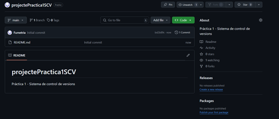

Procedemos a clonar el repositorio:

  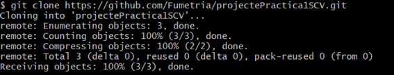

El usuario 1 crea la rama *develop* y actualiza el repositorio remoto, poniendo la rama *develop* como rama de referéncia.

  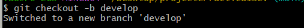
  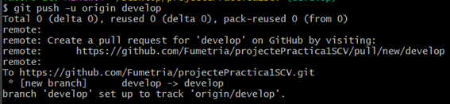 

Inicia gitFlow:

  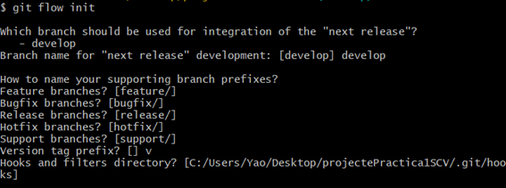

Creamos proyecto con la estructura del boilerplate asignada y creamos el index.html ajustandonos a las necesidades del cliente y procedemos a actualizar el repositorio remoto.

  ### 2. Usuario 2

  **El usuario 2 creará dos secciones nuevas y las implementará como dos features cada sección.**

Empezamos clonado el repositorio:

  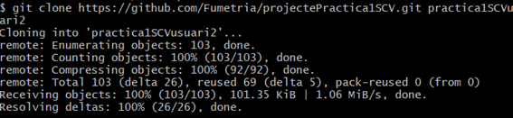

Una vez clonado iniciamos gitFlow:

  

 Iniciamos una nueva feature, una vez iniciada, ara las tareas solicitadas y hará commit con estas modificaciones.

  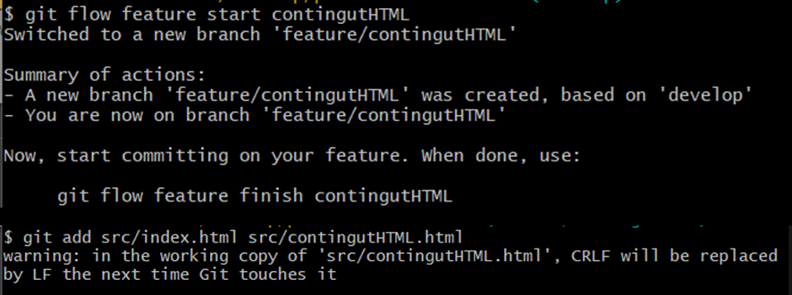

Un vez hechas las tareas, se procede a publicar la nueva feature hacia el repositorio:

  

Hacemos lo mismo con la segunda feature solicitada:

  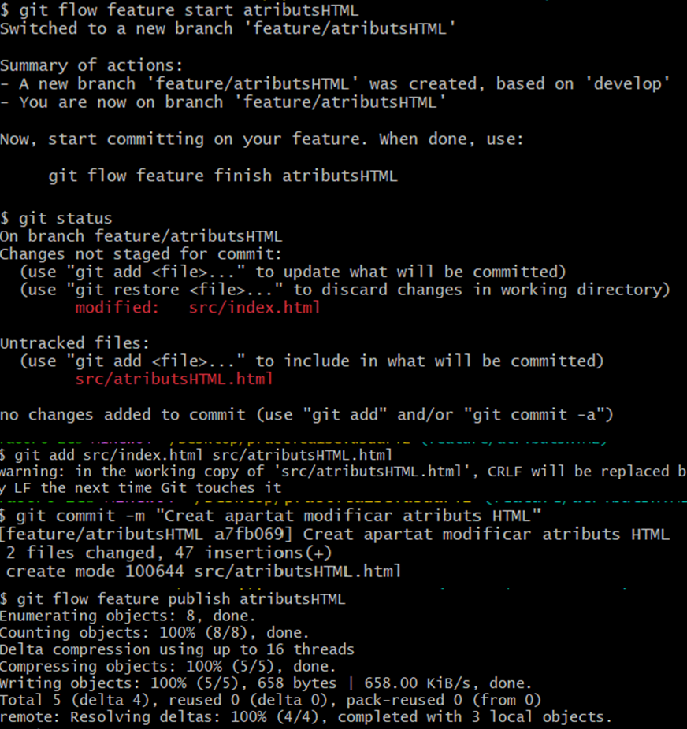

Una vez publicado, nos vamos al repositorio para hacer **merge** con la rama *develop*

  ![gitFlow feature 2 merge.]

  ### 3. Usuario 3

  **El usuario 3 creará una nueva feature y creará un release**

Empezamos clonado el repositorio, iniciamos gitFlow y abrimos nueva feature, para posteriormente publicarla en repositorio haciendo luego merge con la rama *develop*.

  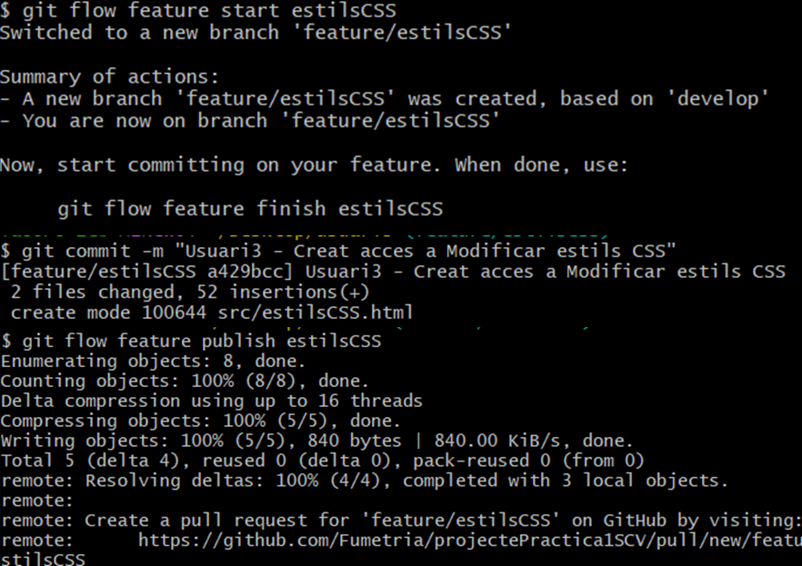

Creamos la pull request

  

Posterioremente creamos la release v1.0 en la rama *main*.

  

  ### 4. Hotfix

  **El usuario 1 creará un *hotfix* sobre las secciones del usuario 2**

Empezamos creando una rama de hotfix.

  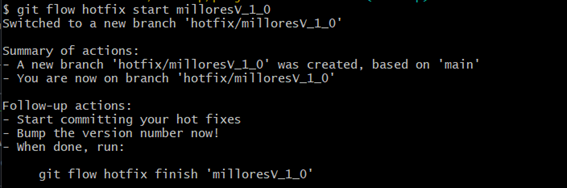

Hacemos las modificaciones y hacemos el commit correspondiente.

  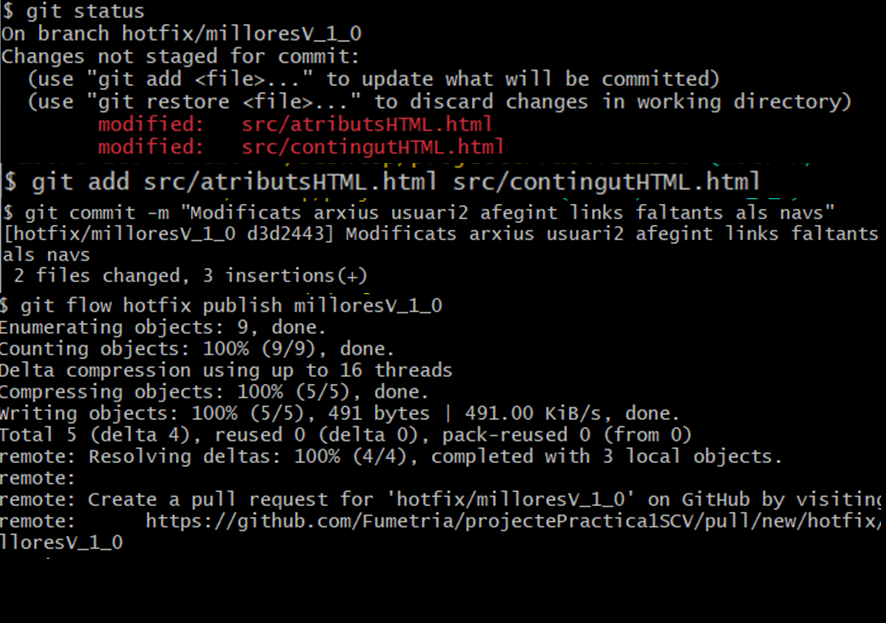

Posteriormente hacemos merge sobre la rama develop y luego lo pasamos a la rama *main*.

  

